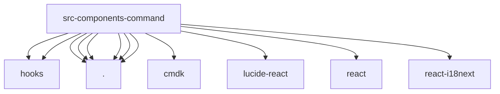

# Imports

[← Back to MODULE](MODULE.md) | [← Back to INDEX](../../INDEX.md)

## Dependency Graph

## External Dependencies

Dependencies from other modules:

- `../../hooks/useCommandMenu`
- `../../hooks/useSearchPlugins`
- `./CommandEmpty`
- `./CommandError`
- `./CommandHints`
- `./CommandItem`
- `./CommandLoading`
- `./CommandMenu`
- `cmdk`
- `lucide-react`
- `react`
- `react-i18next`

