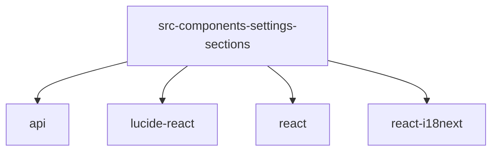

# Imports

[← Back to MODULE](MODULE.md) | [← Back to INDEX](../../INDEX.md)

## Dependency Graph

## External Dependencies

Dependencies from other modules:

- `@tauri-apps/api/core`
- `lucide-react`
- `react`
- `react-i18next`

