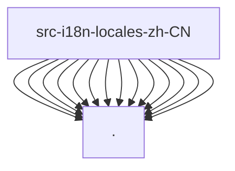

# Imports

[← Back to MODULE](MODULE.md) | [← Back to INDEX](../../INDEX.md)

## Dependency Graph

## External Dependencies

Dependencies from other modules:

- `./app`
- `./command`
- `./common`
- `./components`
- `./dashboard`
- `./export`
- `./favorites`
- `./languageSwitcher`
- `./project`
- `./role`
- `./search`
- `./session`
- `./settings`
- `./stats`

