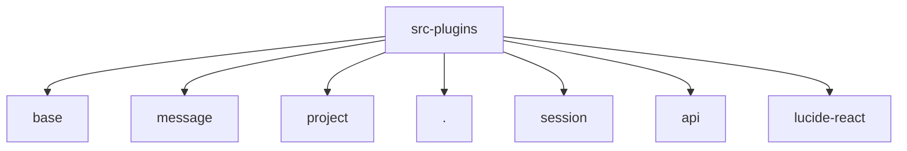

# Imports

[← Back to MODULE](MODULE.md) | [← Back to INDEX](../../INDEX.md)

## Dependency Graph

## External Dependencies

Dependencies from other modules:

- `../base/BaseSearchPlugin`
- `./message/MessageSearchPlugin`
- `./project/ProjectSearchPlugin`
- `./registry`
- `./session/SessionSearchPlugin`
- `@tauri-apps/api/core`
- `lucide-react`

