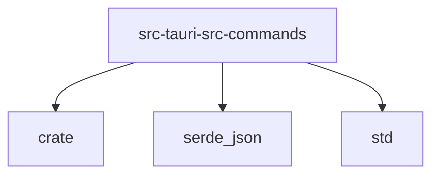

# Imports

[← Back to MODULE](MODULE.md) | [← Back to INDEX](../../INDEX.md)

## Dependency Graph

## Internal Dependencies

Dependencies within this module:

- `favorites`
- `models`
- `search`
- `session`
- `settings`
- `skills`

## External Dependencies

Dependencies from other modules:

- `crate`
- `serde_json`
- `std`

