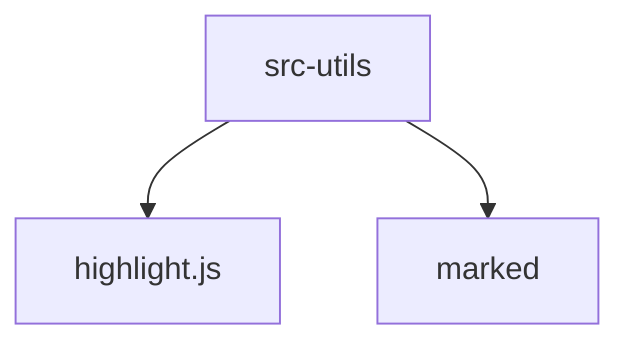

# Module: src/utils

[← Back to INDEX](../../INDEX.md)

**Type:** implicit | **Files:** 5

## Files

| File | Lines | Large |
| ---- | ----- | ----- |
| `src/utils/format.ts` | 40 |  |
| `src/utils/markdown.ts` | 119 |  |
| `src/utils/search.ts` | 63 |  |
| `src/utils/session.ts` | 88 |  |
| `src/utils/settings.ts` | 219 |  |

## Documentation

- [memory.md](memory.md) - Warnings and TODOs

---

## External Dependencies

Dependencies from other modules:

- `highlight.js`
- `marked`
