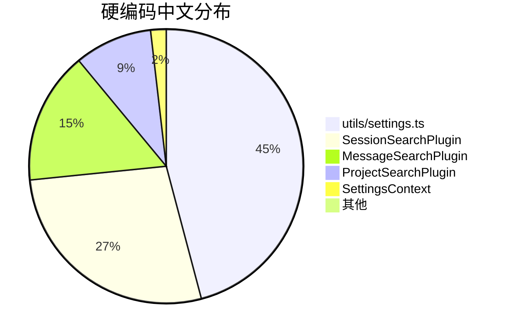

# 硬编码中文扫描结果

**扫描时间**: 2026-02-13  
**扫描范围**: src/ 目录（排除 locales/）  
**总行数**: 655 行包含中文字符

---

## 📊 统计概览



---

## 🎯 优先级分布

| 优先级 | 文件数 | 行数 | 影响 |
|--------|--------|------|------|
| **P0** (立即修复) | 4 | 59 | 用户直接可见 |
| **P1** (高优先级) | 1 | 50 | 功能完整性 |
| **P2** (中优先级) | 1 | 1 | 代码质量 |

---

## 📁 文件清单

### P0 - 立即修复

#### 1. SessionSearchPlugin.tsx (30 行)
- ✅ 插件名称: `'会话搜索'`
- ✅ 插件描述: `'搜索会话名称和元数据'`
- ✅ 时间格式: `'刚刚'`, `'5 分钟前'`, `'3 小时前'`, `'2 天前'`, `'1 周前'`
- ✅ 消息计数: `'${count} 条消息'`

#### 2. MessageSearchPlugin.tsx (17 行)
- ✅ 插件名称: `'消息搜索'`
- ✅ 插件描述: `'搜索用户消息和助手回复'`
- ✅ 时间格式: `'今天'`, `'昨天'`, `'3 天前'`, `'2 周前'`, `'1 月前'`, `'1 年前'`

#### 3. ProjectSearchPlugin.tsx (10 行)
- ✅ 插件名称: `'项目搜索'`
- ✅ 插件描述: `'搜索项目路径'`

#### 4. SettingsContext.tsx (2 行)
- ✅ 错误消息: `'加载设置失败'`, `'保存设置失败'`

---

### P1 - 高优先级

#### 5. utils/settings.ts (50 行)
- ⚠️ 验证消息 (4 条):
  - `'Pi 命令路径不能为空'`
  - `'刷新间隔必须在 5-300 秒之间'`
  - `'缓存大小必须在 10-1000 MB 之间'`
  - `'侧边栏宽度必须在 200-600 px 之间'`

- ⚠️ 格式化显示 (1 条):
  - `value ? '启用' : '禁用'`

- ⚠️ 设置显示名称 (24 条):
  ```typescript
  {
    defaultTerminal: '默认终端',
    customTerminalCommand: '自定义终端命令',
    piCommandPath: 'Pi 命令路径',
    theme: '主题',
    sidebarWidth: '侧边栏宽度',
    // ... 20 more
  }
  ```

---

### P2 - 中优先级

#### 6. ProjectFilterList.tsx (1 行)
- 🔍 逻辑检查: `cwd === '未知'` (应统一为英文常量)

---

## 🔧 修复方案

### Phase 1: 插件 i18n 化 (P0)

**目标**: 让所有插件支持多语言

**修改文件**:
1. `src/plugins/base/BaseSearchPlugin.ts` - 添加 context 支持
2. `src/plugins/session/SessionSearchPlugin.tsx`
3. `src/plugins/project/ProjectSearchPlugin.tsx`
4. `src/plugins/message/MessageSearchPlugin.tsx`

**新增翻译文件**:
- `src/i18n/locales/zh-CN/plugins.ts`
- `src/i18n/locales/en-US/plugins.ts`
- `src/i18n/locales/zh-CN/time.ts`
- `src/i18n/locales/en-US/time.ts`

**示例代码**:
```typescript
// Before
class SessionSearchPlugin extends BaseSearchPlugin {
  name = '会话搜索'
  description = '搜索会话名称和元数据'
}

// After
class SessionSearchPlugin extends BaseSearchPlugin {
  get name() {
    return this.context?.t('plugins.session.name', '会话搜索') || '会话搜索'
  }
  
  get description() {
    return this.context?.t('plugins.session.description', '搜索会话名称和元数据') || '搜索会话名称和元数据'
  }
}
```

---

### Phase 2: 错误和验证消息 (P0-P1)

**目标**: 所有用户可见的错误和验证消息支持多语言

**修改文件**:
1. `src/contexts/SettingsContext.tsx` - 使用 useTranslation
2. `src/utils/settings.ts` - 验证函数接受 t 参数

**扩展翻译文件**:
- `src/i18n/locales/zh-CN/settings.ts` (添加 error 和 validation 部分)
- `src/i18n/locales/en-US/settings.ts`

**示例代码**:
```typescript
// Before
setError('加载设置失败')

// After
const { t } = useTranslation()
setError(t('settings.error.loadFailed', '加载设置失败'))
```

---

### Phase 3: 清理和优化 (P2)

**目标**: 清理技术债务，统一代码风格

**任务**:
1. 检查 `getSettingDisplayName()` 是否还在使用
2. 如果未使用，删除整个函数
3. 统一 `Unknown` 常量为英文

---

## 📋 翻译 Key 规划

### plugins.ts (新增)

```typescript
// zh-CN
export const plugins = {
  session: {
    name: '会话搜索',
    description: '搜索会话名称和元数据',
  },
  project: {
    name: '项目搜索',
    description: '搜索项目路径',
  },
  message: {
    name: '消息搜索',
    description: '搜索用户消息和助手回复',
  },
}

// en-US
export const plugins = {
  session: {
    name: 'Session Search',
    description: 'Search session names and metadata',
  },
  project: {
    name: 'Project Search',
    description: 'Search project paths',
  },
  message: {
    name: 'Message Search',
    description: 'Search user messages and assistant replies',
  },
}
```

---

### time.ts (新增)

```typescript
// zh-CN
export const time = {
  justNow: '刚刚',
  minutesAgo: '{{count}} 分钟前',
  hoursAgo: '{{count}} 小时前',
  daysAgo: '{{count}} 天前',
  weeksAgo: '{{count}} 周前',
  monthsAgo: '{{count}} 月前',
  yearsAgo: '{{count}} 年前',
  today: '今天',
  yesterday: '昨天',
}

// en-US
export const time = {
  justNow: 'Just now',
  minutesAgo: '{{count}} minutes ago',
  minutesAgo_one: '1 minute ago',
  hoursAgo: '{{count}} hours ago',
  hoursAgo_one: '1 hour ago',
  daysAgo: '{{count}} days ago',
  daysAgo_one: '1 day ago',
  weeksAgo: '{{count}} weeks ago',
  weeksAgo_one: '1 week ago',
  monthsAgo: '{{count}} months ago',
  monthsAgo_one: '1 month ago',
  yearsAgo: '{{count}} years ago',
  yearsAgo_one: '1 year ago',
  today: 'Today',
  yesterday: 'Yesterday',
}
```

---

### settings.ts (扩展)

```typescript
// zh-CN
export const settings = {
  // ... 现有内容
  error: {
    loadFailed: '加载设置失败',
    saveFailed: '保存设置失败',
  },
  validation: {
    piCommandPathRequired: 'Pi 命令路径不能为空',
    refreshIntervalRange: '刷新间隔必须在 5-300 秒之间',
    cacheSizeRange: '缓存大小必须在 10-1000 MB 之间',
    sidebarWidthRange: '侧边栏宽度必须在 200-600 px 之间',
  },
}

// en-US
export const settings = {
  // ... existing content
  error: {
    loadFailed: 'Failed to load settings',
    saveFailed: 'Failed to save settings',
  },
  validation: {
    piCommandPathRequired: 'Pi command path is required',
    refreshIntervalRange: 'Refresh interval must be between 5-300 seconds',
    cacheSizeRange: 'Cache size must be between 10-1000 MB',
    sidebarWidthRange: 'Sidebar width must be between 200-600 px',
  },
}
```

---

### common.ts (扩展)

```typescript
// zh-CN
export const common = {
  // ... 现有内容
  enabled: '启用',
  disabled: '禁用',
  unknown: '未知',
}

// en-US
export const common = {
  // ... existing content
  enabled: 'Enabled',
  disabled: 'Disabled',
  unknown: 'Unknown',
}
```

---

## ⏱️ 工作量估算

| Phase | 任务 | 工作量 | 优先级 |
|-------|------|--------|--------|
| Phase 1 | 插件 i18n 化 | 2h | P0 |
| Phase 2 | 错误/验证消息 | 1h | P0-P1 |
| Phase 3 | 清理优化 | 0.5h | P2 |
| 测试验证 | 语言切换测试 | 0.5h | - |
| **总计** | | **4h** | |

---

## ✅ 验证清单

修复完成后需要验证：

- [ ] 所有插件名称和描述支持中英文
- [ ] 时间格式化支持中英文（7 种格式）
- [ ] 错误消息支持中英文（2 条）
- [ ] 验证消息支持中英文（4 条）
- [ ] 切换语言后所有文本立即更新
- [ ] 无控制台警告（missing translation keys）
- [ ] 英文环境下所有文本正确显示
- [ ] 中文环境下所有文本正确显示

---

## 🔗 相关文档

- [i18n 配置文档](../architecture/i18n-architecture.md)
- [插件开发指南](../architecture/plugin-architecture.md)
- [翻译贡献指南](../CONTRIBUTING.md#translations)

---

## 📝 备注

1. **utils/settings.ts 的 getSettingDisplayName()** 函数可能已废弃，需要检查调用点
2. **插件架构改进**：考虑在插件构造函数中注入 i18n context
3. **时间格式化**：考虑使用 date-fns 或 dayjs 的 i18n 插件
4. **验证消息**：考虑将验证逻辑移到 React 组件层，方便访问 useTranslation

---

**下一步**: 开始 Phase 1 - 插件 i18n 化

详细实施计划见: [硬编码中文审计报告](./20260213-hardcoded-chinese-audit.md)
